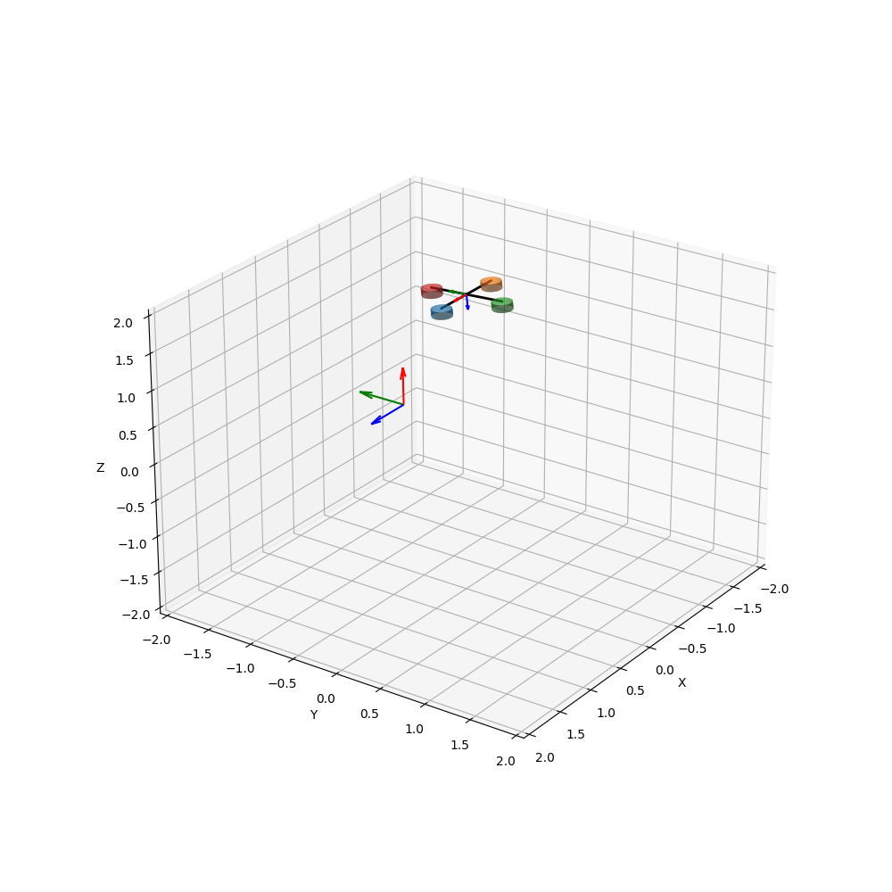

This is an Unmanned Aerial Vehicles (UAVs) simulator. it can simulate, animate and save a video of a single UAV or multi-UAVs. The structure of the simulator is as follows:

# SingleUAV Folder:
This folder contains the `uav.py` file, which encodes the dynamic model of a single uav. In addition, it has the `initialize.py` which initializes the states, initial and final time, time step and gravitational acceleration constant. For animation, check the `AnimateSingleUAV.py` file.

 In order to start the simulation for a single UAV, there exists the main file `mainSingleUav.py`. This file initializes an instance of the uavModel and Controller objects (ControllerUAV --> `controller.py`), then a _for_ loop starts, where the states evolution takes place while generating the control input at each time step _dt_. 
 
A simple test of the simulator is done using circle trajectory and hover to certain pose (check UAV_Trajectory --> `UavTrajectory.py`). Change the value of *traj_choice* variable inside `mainSingleUav.py`. Finally to animate and save video inside Video Folder, manipulate the booleans _animateAndSave_, _show_ and _save_. 
The following gif shows the uav tracjing a circular trajectory, starting from an almost upside down pose. 

To test the simulator for a single UAV, open a terminal inside the UAVsimulator folder, then run
 ```bash
python3 SingleUAV/mainSingleUav.py 
```
To save a video or gif, change the boolean _save_ to *True* (The default is False), and choose the name and extension of the video in *videoname* string variable.

___
___
# MultiUAVs Folder:
The MultiUAVs folder has the same structure as SingleUAV folder. This is still under development, and the main idea of creating such folder is to test whether the abstraction level that was used in the single UAV is consistent and can handle the multi-UAVs case. the `mainMUltiUavs.py` is the treated as the main file, where it initializes of multirobots team as a dictionary with the number of team members and initial state of each UAV (check `initializeMultiUavs.py`) 
To test the simulator for a single UAV, open a terminal inside the UAVsimulator folder, then run
 ```bash
python3 MultiUAVs/mainMultiUavs.py
```

___
___
# Tasks List
## Single UAV:
* [ ] Generating Trajectories from given waypoints using Polynomials.
* [ ] Add Feed-forward Terms to the controller
___
## Multi UAV:
* [ ] Manipulating Axes limits in Animation
* [ ] Testing Formation Control Algorithms For Multi-UAVs.
___
